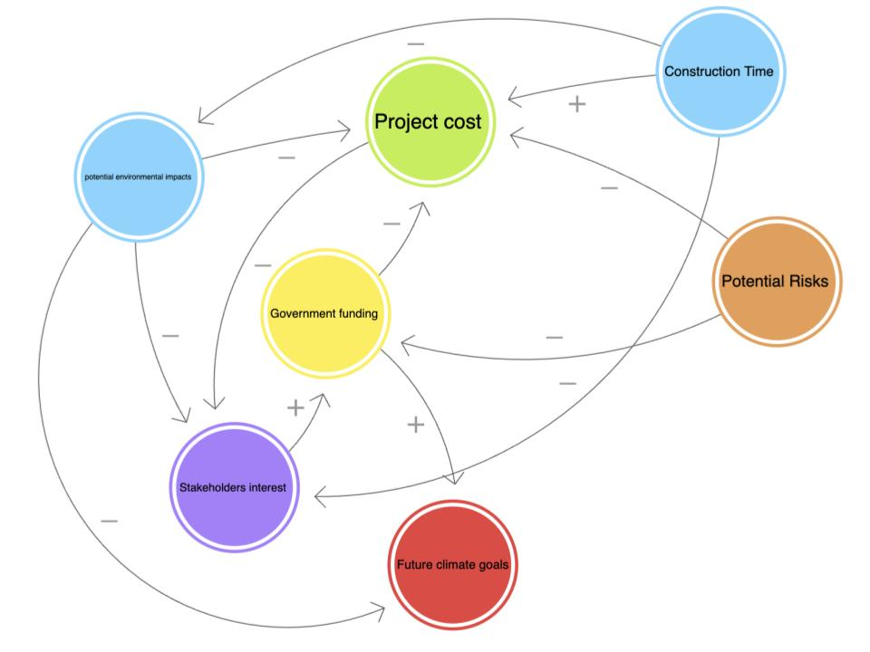

# BSAD482-Milestone-1-

# Wind VS Water: How Should Newfoundland and Labrador Power Their Clean Energy Future? 

## Decision Statment
Andrew Parsons - Newfoundland and Labrador Minister of Industry, Energy and Technology answers the question: Should the government of Newfoundland and Labrador prioritize coastal wind-power development or hydroelectric development going forward to meet climate targets?

## Executive Summary 
This decision matters greatly to both the Provincial Government of Newfoundland and Labrador as well as the Federal Government of Canada as in recent times the push for clean energy has not only become a want, but a need. This decision is especially important to those in Newfoundland and Labrador as the success of failure of the project will directly affect them. 

As seen in previous attempts, the push for clean energy does not always produce a positive outcome. With data driven choices, Newfoundland and Labrador can choose a future that is best for them and their environmental impacts.

## Initial CLD

## Refined CLD

### Explanation of Key Feedback Loops 
B1: This feedback loop portrays one of the most important variables in this decision; the public opinion. In the past, highly publisized investments (Such as Churchill Falls) have eroded public trust in the governments decision making. This loop represents how higher investment into electricity generation affect the affordability of electricity for Newfoundland and Labrador. When investments are high, affordability is negativly affected as resedents now have to pay higher electricity bills. Public trust is negativly affected when affordability goes down thus, impacting stakeholders concerns about the project. If skeptisism is high, stakeholders may invest less in the final project. This loop shows the importance of public trust and afforability within this decision. The implications for this decision are that Minister Parsons cannot commit to either wind or hydro and expect to maintain public trust. Project spending and capital investment must be monitored to avoid overspending and large impacts to affordability. 

B2: This loop reflects 
This Balencing loop shows how political systems react to emissions pressures. Looking Forward at sustaiability goals, this loop visualizes the importance of investment and political willingness to reduce emissions. High emissions can highten political willingness to spend on sustainability efforts (such as hydro and wind technology). This investment increases the renewable technology available to Newfoundland and Labrador, in turn lowering emissions. The implications of this loop are that whichever project is chosen, it must lower emissions to maintain the political systems willingness to invest further. 

### Supporting CLD With Evidence 
Renewable Energy Capacity -> (-) -> NL Emissions
The Government of Canada found that emissions reduction is directly linked to the use of “renewable energy sources to generate electricity” (Government of Canada, 2025)

Political Willingness -> (+) -> Government Investment 
This positive relationship is evidenced by the previous hydroelectric project, Muskrat Falls. Strong political support led to an approximatly $7 Billion initial investment into the projecy (Fitzpatrick, 2024)

Existing Infrastructure -> (-) -> Project Spending
Newfoundland has an established advanced hydroelectric system that accounts the largest portion of their total electric generation as seen in table a (reference My own chart CHANGE). This existing infrastructure in specific regions of the island lowers the  capital investment needed for investment into hydroelectricity (Canada Energy Regulator, 2023).

## Data Sources 

Government of Canada (2026). Monthly Climate Summaries. Canada.ca. https://climate.weather.gc.ca/prods_servs/cdn_climate_summary_e.html

Government of Newfoundland and Labrador, (2025). Historical GHG Emissions Summary Newfoundland and Labrador, 1990-2023. https://www.gov.nl.ca/eccc/files/Historical-GHG-Emissions-Summary-NL-1990-2023-Mar-2025.pdf

Newfoundland Hydro (2026). Publications, Annual Reports 2017-2024. https://nlhydro.com/about-us/publications/

Statistics Canada, (2026). Electric power generation, monthly generation by type of electricity. https://www150.statcan.gc.ca/t1/tbl1/en/tv.action?pid=2510001501

Statistics Canada, (2024). Household energy consumption, Canada and provinces https://www150.statcan.gc.ca/t1/tbl1/en/tv.action?pid=2510006001

