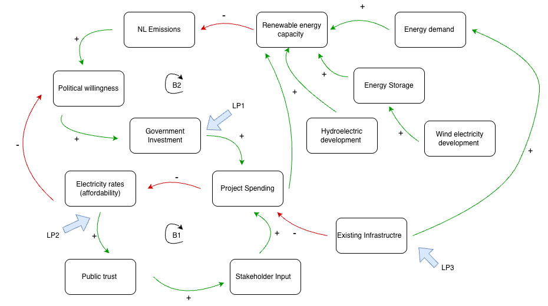

# BSAD482-Milestone-1-

# Wind VS Water: How Should Newfoundland and Labrador Power Their Clean Energy Future? 

## Decision Statment
Andrew Parsons - Newfoundland and Labrador Minister of Industry, Energy and Technology answers the question: Should the government of Newfoundland and Labrador prioritize coastal wind-power development or hydroelectric development going forward to meet climate targets?

## Executive Summary 
This decision matters greatly to both the Provincial Government of Newfoundland and Labrador as well as the Federal Government of Canada as in recent times the push for clean energy has not only become a want, but a need. This decision is especially important to those in Newfoundland and Labrador as the success of failure of the project will directly affect them. 

As seen in previous attempts, the push for clean energy does not always produce a positive outcome. With data driven choices, Newfoundland and Labrador can choose a future that is best for them and their environmental impacts.

# Table of Contents 
<h2 id="Background">Background</h2>
<h2 id="Data-Sources">Data Sources</h2>
<h2 id="Exploratory-Findings">Exploratory Findings</h2>

<a href="#Backgro
## Initial CLD
<a href="#Exploratory-Findings">Go to Exploratory Findings</a>

## Refined CLD

### Explanation of Key Feedback Loops 
B1: This feedback loop portrays one of the most important variables in this decision; the public opinion. In the past, highly publisized investments (Such as Churchill Falls) have eroded public trust in the governments decision making. This loop represents how higher investment into electricity generation affect the affordability of electricity for Newfoundland and Labrador. When investments are high, affordability is negativly affected as resedents now have to pay higher electricity bills. Public trust is negativly affected when affordability goes down thus, impacting stakeholders concerns about the project. If skeptisism is high, stakeholders may invest less in the final project. This loop shows the importance of public trust and afforability within this decision. The implications for this decision are that Minister Parsons cannot commit to either wind or hydro and expect to maintain public trust. Project spending and capital investment must be monitored to avoid overspending and large impacts to affordability. 

B2: This loop reflects 
This Balencing loop shows how political systems react to emissions pressures. Looking Forward at sustaiability goals, this loop visualizes the importance of investment and political willingness to reduce emissions. High emissions can highten political willingness to spend on sustainability efforts (such as hydro and wind technology). This investment increases the renewable technology available to Newfoundland and Labrador, in turn lowering emissions. The implications of this loop are that whichever project is chosen, it must lower emissions to maintain the political systems willingness to invest further. 

### Supporting CLD With Evidence 
Renewable Energy Capacity -> (-) -> NL Emissions
The Government of Canada found that emissions reduction is directly linked to the use of “renewable energy sources to generate electricity” (Government of Canada, 2025)

Political Willingness -> (+) -> Government Investment 
This positive relationship is evidenced by the previous hydroelectric project, Muskrat Falls. Strong political support led to an approximatly $7 Billion initial investment into the projecy (Fitzpatrick, 2024)

Existing Infrastructure -> (-) -> Project Spending
Newfoundland has an established advanced hydroelectric system that accounts the largest portion of their total electric generation as seen in table a (reference My own chart CHANGE). This existing infrastructure in specific regions of the island lowers the  capital investment needed for investment into hydroelectricity (Canada Energy Regulator, 2023).

## Data Sources 

### Government of Canada (2026). Monthly Climate Summaries. Canada.ca. https://climate.weather.gc.ca/prods_servs/cdn_climate_summary_e.html
Data Shows monthly climate measurements taken from weather stations across Newfoundland and Labrador. 

### Government of Newfoundland and Labrador, (2025). Historical GHG Emissions Summary Newfoundland and Labrador, 1990-2023. https://www.gov.nl.ca/eccc/files/Historical-GHG-Emissions-Summary-NL-1990-2023-Mar-2025.pdf
Data displays the recorded emissions for each sector, displaying both total NIR (National Inventory report) emissions and GHG total emissions. 

### Newfoundland Hydro (2026). Publications, Annual Reports 2017-2024. https://nlhydro.com/about-us/publications/
Data shows financial reports from Newfoundland Hydro. Data compiled comes from pdf reports from 2017-2024. 

### Statistics Canada, (2026). Electric power generation, monthly generation by type of electricity. https://www150.statcan.gc.ca/t1/tbl1/en/tv.action?pid=2510001501
Data shows the monthly power generation from each type of electricity. Hydraulic turbones and pind turbines are foccussed on in detail. 

### Statistics Canada, (2024). Household energy consumption, Canada and provinces https://www150.statcan.gc.ca/t1/tbl1/en/tv.action?pid=2510006001
Data provides statistics regarding household energy consumption for Newfoundland and Labrador. Figures diplayed show both household totals and comlete island totals. 

## Exploratory Data Analysis
### Average January Temperature NL 2016-2026

This visualization displays the average temperature taken monthly from 2016-2026. This is extramly important to this decision as increasing temperatures can be directly linked with climate change. "Temperature is a key indicator of how the climate is changing in response to greenhouse gas (GHG) emissions from human activities, as increasing GHG concentrations result in warming of the lower atmosphere (Government of Canada, 2025). To make any decision regarding future sustainability goals, one must look at the changing climate of Newfoundland and Labrador. This visualization shows the steady increase in temperature over the past decade, further emphasizing the need to push sustainability efforts. 

### Wind Power Turbine Electricity Generation 2015-2024

This visualizations shows the growing use of wind turbine technology in Newfoundland and Labrador. While its not as developed as hydropower methods of energy production, the use of wind technology has been steadily increasing on the island as there have been proposals for future development. "There is a great opportunity to kick start offshore wind energy in Western Newfoundland because of the constant wind and shallow water for installing wind farms" (Government of Canada, 2025). This Visualization is helpful in the decision making process as the decision maker must be aware of the initial growth of this relitivly new sector on the island. As seen in the visualization, wind technology has seen large growth in the past decade. While still in its infancy, wind technology could be the future of sustainability in Newfoundland and Labrador, and the decision maker must see its growth in its initial stages. 

### Electricity Generation Water Vs Wind 2020-2024 

This visualization displays the portion of electric generation created by both hydropower and wind power. The large difference in electric generation between the two shows how developed hydropower has been the largest contributer to Newfoundland and Labradors sustainablility practices. This visualization is needed to answer this question as the decision maker must know how much electricity each contributes, as well as potential areas for growth. 

### Hydraulic Turbines Impacts on Total Emissions NL 2009-2023

These reports shows the relationship between emissions and hydro power, and how the use of sustaiable electricity can effect the emission output of the island. As seen in the visualization, as hydro generation goes up, the reported amount of emissions goes down. There is a notable dip in emissions for the year 2020, as this was during the COVID-19 self isolation period. This report is important for the decision maker as they can see how established hydro-technology has helped influence emissions, and if it is worth it to continue on this path to power their clean energy future. The use of trendlines helps display the rise in hydro-electric generation and the fall in emissions from 2009-2023. 

## Archytype Analysis 
### Growth and Underinvestment 
In the casaul loop diagram, one of the main relationships present is between renewable energy capacity and monatary investments. Government Investment, project spending, and infrastructure development are all factors that contribute to the growth of renewable technology on the island. While demand for renawable infrastructure is rising, the physical development of both alternative is dependant on government investment and project spending. If investments are delayed, a negative relationship is created where little investment causes slower development for renewable technology. The key loop involved is the B2 balenecing loop, where potential investment (or underinvestment) can negativly or positivly affect the infrastructure needed to develop renewable technology alternatives. Growth in the energy system depends on investment timing and economic conditions as the Canada Energy Regulator (2023) notes. More evidence comes from past hydro electric development in Newfoundland and Labrador, where the Muskrat Falls project investments were delayed significantly, causing slower infrastructural growth due to its reliance on investment. 

## Scenario Narratives
### Status Quo
If all aspects of Newfoundland and Labrador's current sustainability efforts stay the same, we will see small incremental growth in its hydro power development over the next 5-10 years. We can infer that water power will be prioritized, as in the past 5 years Newfoundland and Labrador has seen growth in their hydroelectric output. In 2024 hydraulic turbine electric generation made up 96% of total electricity generation on the island (Electricity Generation Water and Wind 2020-2024). In addition, the existing investments into hydro energy infrastructure provides further evidence that this alternative would be prioritized. As seen in the CLD diagram, investment into hydroelectric development increases sustainable energy generation, thus leading to further emissions reduction. There may be some investments into wind technology, as the provincial government stated in their 2021 renewable energy plan that they have made the initial strides in the “multi stage process” to enable wind technology on the island. While this does seem plausible, the number of wind turbines has had limited growth since this proposal. One uncertainty in this scenario is the potential future demand for clean energy If the demand for clean energy rises in the next 5-10 years, Newfoundland and Labrador may need to reevaluate their sustainability initiatives. 

### Intervention A
If Newfoundland and Labrador choose to prioritize hydroelectric development, the province may see changes occur. Hydroelectricity has been the primary driver in the sustainable energy plan Newfoundland and Labrador has utilized for the past decade. We have seen more recent growth in hydro electric production with electricity generation from hydraulic turbines increasing from 38,324,062 MWh in 2020 to 45,740,857 MWh in 2024 (Electricity Generation Water Vs Wind 2020-2024). This alternative seems the ‘easier’ option of the two as existing hydroelectric infrastructure exists, but if expansion of this infrastructure is prioritized a much higher investment is needed. Previous hydro development projects come with a large price tag. For example, the Muskratt Falls project had estimated costs of $7.2 Billion, and has been said to have exceeded this by $6.3 Billion (Fitzpatrick, 2024). “Rate mitigation” tactics had to  be put in place to keep bill costs low for the average NL resident. Hydroelectric development is not cheap, and if some of these costs are turned over to the public, public trust and stakeholder impact may be negatively impacted. As seen in the CLD Diagram, when affordability goes down, the public can become distrusting of the government, this in turn impacts stakeholder input and eventually project investments as a whole. With the prioritization of this alternative, costs may go up in the next 5-10 years for the average resident, so the government must be able to mitigate these costs to eliminate the possibility of a Muskrat-Falls-repeat. The major uncertainty for this alternative is the risk of cost overruns. As seen historically, cost is a major factor in hydroelectric development, and the government of Newfoundland and Labrador must mitigate these if they wish to prioritize this alternative in the foreseeable future. 

### Intervention B 
If the government of Newfoundland and Labrador decides to prioritize wind development, they will likely see fast infrastructural, and energy capacity growth in the next 5-10 years. This is because the infrastructural demands of building wind technology are less than those of traditional hydroelectric development. As seen in the Wind Power Turbine Electricity Generation 2015-2024 visualization, wind power electricity generation has been on a steady increase over the past decade; even with small investments. So if chosen to be prioritized as the main sustainable model, these numbers would grow exponentially over the next 5-10 years. Unlike Hydro power, this alternative would require less upfront capital, making it the more cost effective option between the two. This lower cost option will also appeal to the public as their own costs may not be affected drastically. With help from the CLD diagram we can see how public trust is intertwined with project investment. When a project appeals more to the public, investors are willing to provide additional funding. The main uncertainty with this alternative is the variability of weather components. Unlike hydro, this alternative is highly weather dependent. Wind turbines require a minimum of 12-14 KM/h to begin generating energy, and must be turned off when high winds (50-60 KM/h) begin as they may damage the turbine (Hydro Quebec, 2026). Overeliability on intermittent wind technology could possibly bring negative effects as it may not provide the energy needed. 

## Leverage Point Analysis
The most effective leverage point in the system is not directly related to hydro or wind power, but with the entire infrastructure for both choices. Government investment into grid capacity infrastructure would benefit both options, as it increases the generating capacity available. This leverage point allows for new and existing infrastructure to be used more efficiently. While this avenue would require considerable upfront effort, it comes with higher rewards compared to building either hydro or wind infrastructure. This leverage point affects the B2 loop as improved infrastructure efficiency then increases the amount of  renewable energy being utilized. Using more renewable energy causes emissions to go down, thus increasing political willingness to invest in a sustainable alternative that decreases emissions. While this leverage point has many positive aspects, it also comes with its associated risks. This alternative requires high upfront costs to update grid infrastructure. This may affect the B1 loop as seen in previous project failures in the island's history. If energy costs rise for the public, they may become distrustful of the government. Resistance is also anticipated from political figures as political willingness is a large factor in the success of this project. Support for this project may vary compared to other projects as there is less physical output being presented to the public. 

## Implications for the Decision
This analysis reveals that renewable energy systems in Newfoundland and Labrador are highly affected by balancing loops, particularly those related to emissions reduction, customer affordability, and willingness to support. Both options put forward work towards lowering emissions, but factors like associated cost and infrastructure needs should be considered in this decision. Historical data shows us that increased sustainable energy production contributes greatly to emissions reduction, and hydro power played a big role in this. However, there have been past hydro power projects that have not been successful in the past, showing that high upfront investment can negatively influence stakeholder support by bringing higher costs for the public. 
Based on this analysis, hydro energy production is a reliable option as it has been the island's primary source of renewable energy for over a decade. Adding on to existing infrastructure seems like the obligatory option because of past choices, but it comes with its own associated risks. The high costs of this alternative may spill into the public's affordability, as seen with Muskrat Falls. Wind energy prioritization offers a more flexible lower-cost alternative, but also comes with lower capacity for energy generation. Wind power would also be a relatively new investment for Newfoundland and Labrador as it only accounted for 4% of the island's electricity generation in 2024. There are still some key uncertainties in this decision. Aspects like future technological advancements and electricity demand are not known. The effectiveness of project funding is also uncertain, as the archetype analysis showed the decision's dependence on strategic decision making when it comes to investments. 
The analysis provided suggests that wind power offers a more sustainable path forward, but a more balanced approach may be needed in the future. Prioritization of wind power offers a more flexible low cost option for sustainable energy, but hydro power should not be completely ignored. 

## Final CLD 

The final CLD represents the factors contributing to the decision of what form of energy production should Newfoundland and Labrador focus on to power their sustainable future. Newfoundland and Labrador has primarily used Hydro power to reduce emissions, but a focus on the unfamiliar alternative of wind power could potentially bring lower costs and more flexibility. The key outcome of this decision is to provide emissions reduction through sustainable energy. The systems archetype identified for this project is growth and underinvestment, meaning that the project is restrained by funding.The major feedback loops in this diagram visualize the key relationships that affect this decision, many of them relating to dependence on project funding. In the B1 balancing loop we see the relationship between project cost, affordability, and public trust. As seen with previous sustainable energy projects, high costs can affect affordability for the public. As prices surge, public trust goes down with it. This distrust coming from the public impacts the feelings of stakeholders, and may erode their own trust in the project outcomes. Stakeholders are directly linked to project funding; the less confident a stakeholder feels about a project, the less funding is put into it. The second balancing loop in this diagram shows the relationship between lowering emissions and project funding. If energy production is successful in lowering emissions, political willingness to invest goes up. This then positively influences the government and project spending into new sustainably focused infrastructure. The structure of this system drives behavior through the relationships between the balancing feedback loops, which when working together shape the success of renewable energy and emissions reduction in Newfoundland and Labrador. This project does not have continuous exponential growth, as it is limited through the B1 loop. This growth is limited through financial and social factors rather than lack of demand for the product, as energy is always needed. Interventions in the system are most effective when they target key areas such as government investment, public affordability, and infrastructure. Increased investment strengthens emissions reductions, while strategic funding can help control affordability. Available infrastructure promotes growth and allows renewable energy to continue to grow on the island. This CLD is directly related to the decision maker's choice towards either wind or hydro. It helps visualize the possible risks and outcomes from choosing each option through a detailed description of the relationships present in this decision. 

## Decision Reccomendations 
To Andrew Parsons, It is recommended that the Government of Newfoundland and Labrador prioritizes renewable wind energy to power their clean energy future. This approach offers the most cost-effective balanced avenue towards a clean future through controlling public affordability and public trust. 

This analysis shows the clear relationship between hydroelectric development and emissions reduction as it has been the main focus of the provincial government over the past decade as it made up 97% of Newfoundland and Labrador's electricity generation in 2024. While this is true, hydro development is costly and carries political and social risks after previous project failures, such as Muskrat Falls. Large-scale hydro projects are also associated with complicated logistical planning and high upfront development costs. In contrast, wind turbine development offers lower financial risk and more flexibility through their smaller-scale planning and lower upfront costs when compared to hydropower. There is also great social and political interest in this alternative. Recent data shows growth in this area, as electricity generated by wind turbines has seen large increases in recent years. While wind energy can be seen as less consistent due to its reliability on wind patterns, this can be addressed through improvements in grid infrastructure and energy storage solutions. A shift towards wind technology does not mean abandonment of past sustainable energy projects. Combining new efforts with past hydro infrastructure can help contribute positively to emission reduction as a whole. While a large portion of energy used comes from renewable energy (primarily Hydro) Newfoundland and Labrador are feeling the effects of climate change. The average temperature has seen a steady increase over the past decade, showing that the efforts to compare global warming still need more investment from the government. 

 As with any project, there are still uncertainties that could affect the wind power recommendation. Future funding in the project, new technology resources, and future energy requirements for the island can all affect this alternative. These uncertainties can influence which of the two options is more effective. In moving forward with this recommendation, the government of Newfoundland and Labrador should take several steps to ensure the success of this project. First, is to invest in grid infrastructure development. This will help increase the island's capacity for renewable technology. Secondly, the government should strategically invest in wind power so as to not drastically increase the electricity rates for the public. This will help keep public trust in the project high. Lastly, they should gradually roll out wind technology to support gradual expansion, this way costs remain stable for the public. In pairing wind-development with existing hydro infrastructure, Newfoundland and Labrador will keep its goal of reducing provincial greenhouse gas emissions by 30% below 2005 levels by 2030. 

